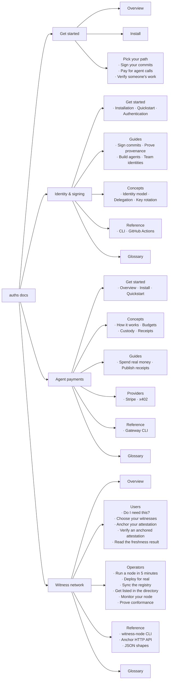

# Docs IA redesign — Stripe-shaped navigation

**Date:** 2026-07-20 · **Status:** rev 2 — §4 shipped, rest proposed ·
**Scope:** `auths-docs` information architecture, navigation contract, content
layout, and a full rewrite of the witness-network section.

**Already landed:** the witness-network rewrite (§4) is implemented —
`witness` is a third area in `lib/content.ts`, the 16 new pages are in
`content/docs/witness-network/`, the 6 old pages are gone (harvested, not
binned), and redirects are wired. `node scripts/check-docs.mjs` is clean at 39
pages. What remains is the *chrome*: top nav + left-caret three-level sidebar
(§7) and the other areas' migration (§8).

Grounded in the branches open right now — **not** from memory:

| Repo | Branch | What it gave us |
|---|---|---|
| `auths-base/auths` | `witness-network` | `witness-node` CLI, `/v1/anchor` API, `deploy/witness/*`, gateway `--anchor-to`/`--witness`, node SDK `verifyActivityAttestation` |
| `auths-base/auths-mcp` | `main` | the packaged gateway consumers install |
| `auths-base/auths-network` | `roster-trust` | the public `/directory` + `/node` console, roster admissions model |

---

## 1. The two axes

Stripe's docs are two independent axes; we currently have one.

1. **Top nav = which world.** Today the area switcher is buried *inside*
   `DocsSidebar`, so you must already be in a world to discover the others.
2. **Left nav = where in this world**, three levels: category → collapsible
   sub-category → page. Today it's two, which is why witness network (6 pages,
   growing) has nowhere to put depth.

**Top nav (4 areas):** `Get started` · `Identity & signing` · `Agent payments` ·
`Witness network`.

**Reference and Glossary are not areas.** Each product area ends its own left
nav with its own `Reference` and `Glossary`. A reader looking up a witness CLI
flag stays inside Witness network; they never bounce to a global reference and
lose context.

---

## 2. Layout

Caret sits **left** of the sub-category label, so labels stay flush and the
expand affordance reads as a disclosure triangle:

```
┌──────────────────────────────────────────────────────────────────────────────┐
│  auths    Get started   Identity & signing   Agent payments   Witness network │  ← top nav
│                                                                  [search ⌘K] │
├───────────────────────┬──────────────────────────────────────────────────────┤
│                       │                                                      │
│  WITNESS NETWORK      │   Anchor your attestation                            │
│                       │   ───────────────────────                            │
│  Overview             │                                                      │
│                       │   Submit your aggregate to your declared witnesses   │
│  ▾ Users              │   and embed the finalized anchor.                    │
│      Do I need this?  │                                                      │
│      Choose witnesses │   auths-mcp export-attestation \                     │
│    › Anchor your att… │     --witness west=<key> --witness east=<key> \      │
│      Verify an anchor │     --witness-threshold 2 \                          │
│      Duplicity proofs │     --anchor-to https://w1… --anchor-to https://w2…  │
│                       │                                                      │
│  ▾ Operators          │   You should see:                                    │
│      Run a node …     │     anchored — 2 cosignature(s), threshold 2         │
│      Deploy for real  │                                                      │
│      …                │                                                      │
│  ▾ Reference          │                                                      │
│  Glossary             │                                                      │
└───────────────────────┴──────────────────────────────────────────────────────┘
   ▾ open (the default)   ▸ collapsed by the reader   › active page
   `Overview` and `Glossary` are one-page sections — plain rows, no caret.
```

Rules — two shapes, chosen by content, never configured:

- **Multi-page section** → a disclosure, caret on the left, **open by default**.
  A wall of collapsed rows hides the structure the nav exists to show;
  collapsing is the reader's opt-in, and navigating into a collapsed section
  re-opens it.
- **One-page section** (`Overview`, `Glossary`) → a **plain row** labeled with
  the section title, linking straight to its page. A caret revealing a single
  child is noise. The row is aligned to the disclosure labels by a spacer the
  width of the caret.

Never a fourth level.

---

## 3. The tree



---

## 4. Witness network — full rewrite ✅ shipped

Implemented as `content/docs/witness-network/`:

| Section | Pages |
| --- | --- |
| Overview | `index.md` |
| Users | `do-i-need-this`, `choose-your-witnesses`, `anchor-your-attestation`, `verify-an-anchored-attestation`, `handle-a-duplicity-proof` |
| Operators | `run-a-node`, `deploy-for-real`, `keep-the-registry-synced`, `monitor-your-node`, `prove-conformance`, `get-listed` |
| Reference | `witness-node-cli`, `anchor-api`, `acceptance-rules` |
| Glossary | `glossary.md` |

**Decision — harvest, don't bin.** Every protocol fact from the six deleted
pages was moved into `Reference`, not discarded: the acceptance-rule table, the
set structural rules, the guarantee-ceiling math, finalization, the freshness
ladder definition, the endpoint table, the roles table, and the hardening
posture all live in `reference/acceptance-rules.md` and
`reference/anchor-api.md`. Task pages link there instead of re-explaining.

**Decision — document interim admissions now.** `operators/get-listed` states
plainly that one Auths-held admissions key decides who appears, that a browser
re-verifies the roster against a *pinned* key plus a content hash, and — the
part that matters — that a compromised or partial directory costs
discoverability, never correctness, because nothing in the protocol consults it.

**Why it was rewritten rather than edited.** The old six pages were organised by
protocol concept and written in protocol vocabulary, so they answered neither
question anyone actually arrives with: *should I use this, and how?* — or, *how
do I run one?* Reorganising by **entity** (`Users`, `Operators`) makes every page
a task with a command, an expected output, and a failure mode.

### 4.1 Users — people who anchor and verify

| Page | Answers | Built from |
|---|---|---|
| **Do I need this?** | A decision, not theory. Unanchored: your attestation is authentic, but rolling it back or showing two buyers different histories is deniable. Anchored: both become attributable. Ends in a yes/no. | product behaviour |
| **Choose your witnesses** | Pick names + keys, pick a threshold. What `t` trades off: liveness vs. how many operators must collude. Where to find operators: the public directory. | `auths-network` `/directory` |
| **Anchor your attestation** | The command, the expected output, the fail-closed rule (below threshold the export fails rather than publishing unanchored). | `--witness`, `--witness-threshold`, `--anchor-to` |
| **Verify an anchored attestation** | One SDK call; read `anchor` — `null` means unanchored, otherwise the verified quorum `{tier, threshold, witnesses, cosigners, seedId}`. A bad anchor fails the whole document. | `verifyActivityAttestation` |
| **Read the freshness result** | `fresh` / `stale` / `unanchored`, reported beside the verdicts, never folded in. What to do about each. | freshness ladder |

Anchor page skeleton (the shape every task page takes):

````md
Submit your aggregate to your declared witnesses and embed the finalized anchor.

**Before you start:** a live attestation export, and 2+ witness URLs.

```bash
auths-mcp-gateway export-attestation \
  --live-dir ./live \
  --root did:keri:<root> --agent did:keri:<agent> \
  --witness west=<key> --witness east=<key> \
  --witness-threshold 2 \
  --anchor-to https://west.example.com \
  --anchor-to https://east.example.com \
  --out activity.json
```

You should see:

```
anchored: 2/2 cosignatures, threshold 2
```

**If it fails:** below-threshold is a hard failure — nothing is written. Check
each witness answers `GET /health`, and that every `--witness` key matches the
key that node actually cosigns with.
````

### 4.2 Operators — people who run a node

| Page | Answers | Built from |
|---|---|---|
| **Run a node in 5 minutes** | `openssl rand -hex 32` → `WITNESS_SEED`, `WITNESS_REGISTRY`, `docker compose up`, confirm `/health`. | `deploy/witness/docker-compose.yml` |
| **Deploy for real** | Helm / Terraform (aws, gcp, azure) / systemd unit; pin the image digest. **The data dir must be a durable volume** — the anchor store is the node's anti-equivocation memory; an amnesiac witness co-signs a fork after restart. | `deploy/witness/{helm,terraform}`, `witness-node.service` |
| **Sync the registry** | `--registry` is a local copy of the parties' public identity registry, used to resolve current keys for party signatures. Keep it synced or valid submissions get refused. | `--registry` |
| **Get listed in the directory** | Submit your entry (`did`, `name`, `region`); it is admitted by an attestation under the pinned admissions key. Browsers verify the roster before trusting any key in it. | `auths-network` roster |
| **Monitor your node** | The console reads `GET /health` and `GET /build`; what each field means; what "unhealthy" looks like. | `auths-network` `/node` |
| **Prove conformance** | `cargo xtask witness-conformance --url http://127.0.0.1:3333` and what the transport checks assert. | xtask conformance |

Quickstart skeleton:

````md
One node, all three roles, on your machine.

```bash
export WITNESS_SEED=$(openssl rand -hex 32)   # keep this stable — it IS your identity
export WITNESS_REGISTRY=/path/to/registry
docker compose -f deploy/witness/docker-compose.yml up
```

Confirm it's up:

```bash
curl -s localhost:3333/health
```

**Keep in mind:** `WITNESS_SEED` changing = a new witness. The `/data` volume
must be durable.
````

---

## 5. Writing rules (enforced, not aspirational)

1. **Show, don't tell.** Every task page leads with the command. Prose exists to
   say what to run and how to know it worked.
2. **No preamble.** ≤ 2 sentences before the first command or list. If a page
   needs more context, that context is a linked concept page.
3. **Every command has expected output.** A page that shows a command without
   showing what success looks like is not finished.
4. **Every page ends with a failure mode.** "If it fails: …" — the one or two
   things that actually go wrong.
5. **Jargon links or dies.** First use of a protocol term links to that area's
   Glossary. If it can't be linked, rewrite the sentence without it.
6. **Concept pages are capped** — ~200 words plus one diagram, and only where a
   decision genuinely requires the concept.
7. **Commands are copy-pasteable and real** — taken from the shipped CLI, with
   placeholders in `<angle brackets>`, never invented flags.

`scripts/check-docs.mjs` grows two gates: fail a page whose first command
appears after N lines, and fail an unlinked term from the area's glossary list.

---

## 6. Navigation contract

Nav stays **derived from frontmatter** — the nav can never disagree with disk.
The contract grows one level.

```yaml
---
title: Anchor your attestation
description: Submit your aggregate to your declared witnesses and embed the anchor.
area: witness-network        # was: product (mcp | identity)
category: Users              # was: section
order: 3
lastReviewed: "2026-07-20"
---
```

- `area` replaces `product`, validated against an area registry rather than a
  hardcoded two-value union.
- `category` replaces `section`.
- `subcategory` (optional) adds the third level where a category needs it.

**`lib/areas.ts`** — the one hand-maintained nav input, replacing
`SECTION_ORDER`, `COLLAPSIBLE_SECTIONS`, and `PRODUCT_LABEL`:

```ts
export interface Area {
  slug: string          // URL segment AND content directory name
  label: string         // top-nav label
  order: number         // top-nav position
  categories: string[]  // display order; put Reference + Glossary last
}
```

Derivation rules (build-time enforced, as today):

1. Unknown `area` fails the build.
2. A category missing from `Area.categories` still renders, last.
3. ~~A category is collapsible iff it has subcategories or > 6 pages.~~
   **Superseded — every section is a disclosure.** A per-area collapse rule
   produced exactly the inconsistency it was meant to avoid (only witness
   network had carets). `COLLAPSIBLE_SECTIONS` is deleted and one shared
   `components/docs/NavSection.tsx` renders every section in every area
   identically: caret left, **open by default**, re-opening if the reader
   navigates into one they collapsed, kept mounted so `aria-controls` resolves.
   There is no second "flat section" shape to drift.
4. Directory name **is** the area slug **is** the URL segment — this kills the
   current `idsigning/` vs `product: identity` vs `/idsigning/*` drift.

`getPrevNext()` flattens depth-first **within an area** and stops at the
boundary.

---

## 7. Component changes

| Component | Change |
|---|---|
| `DocsTopBar` | Gains the area nav (the primary change); active area underlined; collapses to a menu under `md`; search slot. |
| `DocsSidebar` | ✅ *Every* section now renders through the shared `NavSection` disclosure — **caret on the left**, open by default, identical in all areas. Still to do: move the area switcher up into the top bar. |
| `NavSection` | ✅ **New, shared.** The single disclosure used by the sidebar and (via it) the mobile drawer. One component = one behaviour everywhere. |
| `DocsMobileDrawer` | Two-pane: areas → selected area's tree. |
| `DocsPrevNext` | Flatten within area. |
| `app/[...slug]` | Route shape unchanged (`/[area]/…`); only derived nav differs. |

Caret rows are `<button aria-expanded>` inside `<nav aria-label>`; active page
carries `aria-current="page"`. Not raw `<details>` — expanded state must survive
client navigation. Toggle state in `sessionStorage`, keyed by area; expanding a
sibling doesn't collapse others.

---

## 8. Migration

| Now | Becomes |
|---|---|
| `mcp/index.md`, `install.md`, `quickstart.md` | `agent-payments/` · `Get started` |
| `mcp/concepts/*` (4) | `agent-payments/concepts/` · `Concepts` |
| `mcp/guides/*` (2) | `agent-payments/guides/` · `Guides` |
| `mcp/providers/*` (2) | `agent-payments/providers/` · `Providers` |
| `mcp/witness-network/*` (6) | **deleted — rewritten** per §4 into `witness-network/{users,operators}/` |
| `idsigning/{installation,quickstart,authentication}` | `identity/` · `Get started` |
| `idsigning/{sign-commits,prove-provenance,build-agents,team-identities}` | `identity/guides/` · `Guides` |
| `idsigning/concepts/*` (3) | `identity/concepts/` · `Concepts` |
| `idsigning/reference/{cli,github-actions}` | `identity/reference/` · `Reference` (stays in-area) |

New: `get-started/{index,install,pick-your-path}`, the 11 witness-network pages,
and per-area `reference/` + `glossary/` pages.

**Redirects** in `next.config.ts`:

```
/mcp/witness-network/:path*  → /witness-network/:path*
/mcp/:path*                  → /agent-payments/:path*
/idsigning/:path*            → /identity/:path*
```

**Do this before the docs.auths.dev cutover.** That origin still serves mkdocs,
so URL churn is nearly free today and expensive the moment it switches.

---

## 9. Phasing

4. **Rewrite witness network** ✅ **done** — §4. Shipped first because it was
   the content emergency; it also proved the shape.
1. **Contract + registry** — generalise to `lib/areas.ts`, widen frontmatter to
   `area`/`category`/`subcategory`, nested `getNavigation()`. *Partly done:*
   `witness` exists as a third area with `Users`/`Operators`/`Reference`/
   `Glossary` sections; the third nesting level and the registry are still to
   come.
2. **Chrome** — area nav into `DocsTopBar`; left-caret three-level
   `DocsSidebar`; mobile drawer. *Stripe-shaped with today's content.* **This is
   the next job** — witness network already has more sections than the current
   two-level sidebar shows well.
3. **Move files + redirects** for `identity` and `agent-payments`, per §8.
5. **Per-area Reference + Glossary** for the other two areas, then search.

Witness network now has its Reference and Glossary; identity and agent-payments
still need theirs.

---

## 10. Risks

- **Two glossaries drift.** Same term defined twice in different areas.
  *Mitigation:* one shared term source, rendered per-area filtered by tag — a
  glossary page is a view, not a document.
- **Users/Operators split duplicates the anchor format.** Users need to read it;
  operators need to serve it. *Mitigation:* it lives once in
  `Witness network → Reference`; both link there.
- **`> 6 pages` collapse threshold is a guess.** One constant; tune it once real
  counts land rather than restoring a hand-maintained list.
- ~~**The rewrite deletes real content.**~~ *Resolved:* harvested into
  `Witness network → Reference` before the old pages were removed.
- **Witness network now out-sections the sidebar.** It has five sections and
  two collapsible groups while the sidebar is still two-level and the area
  switcher still lives inside it. The content is right; the chrome (§7) is now
  the bottleneck.

## 11. Open questions

1. `Agent payments` (audience language) vs. `auths-mcp` (matches the package)?
   Proposal: label `Agent payments`, slug `agent-payments`, say "auths-mcp" in
   the blurb.
2. Does `Get started` keep its own `Install`, or redirect into each product's?
   Proposal: one install page covering CLI + SDKs, products link to it.
3. ~~Do the operator docs describe interim admissions now?~~ **Answered: yes** —
   documented in `operators/get-listed`, including that it is centralized and
   what that does (and doesn't) put at risk.
4. The docs checker bans `KERI`/`CESR`/`did:keri` as protocol jargon. The new
   pages comply, but `Reference` is where such terms are legitimately needed —
   do we want a narrow allowance for reference pages, or keep the hard ban and
   describe key material in plain terms (current approach)?
